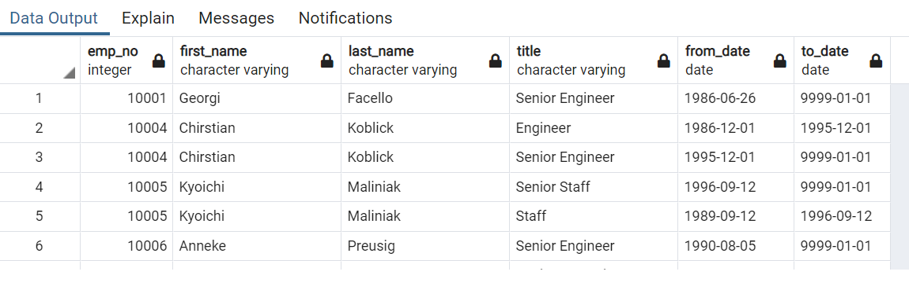
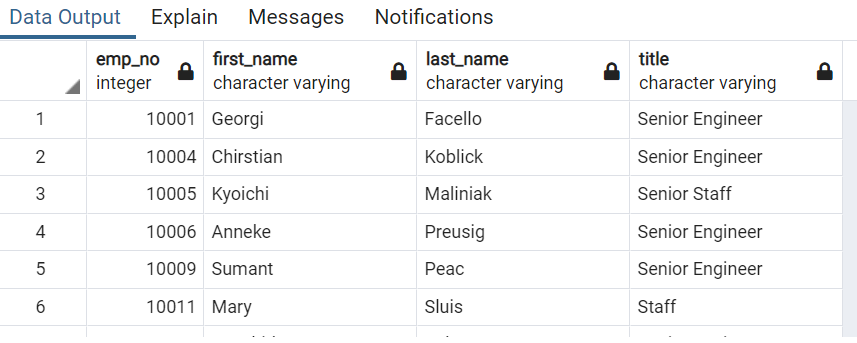
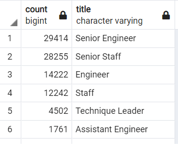
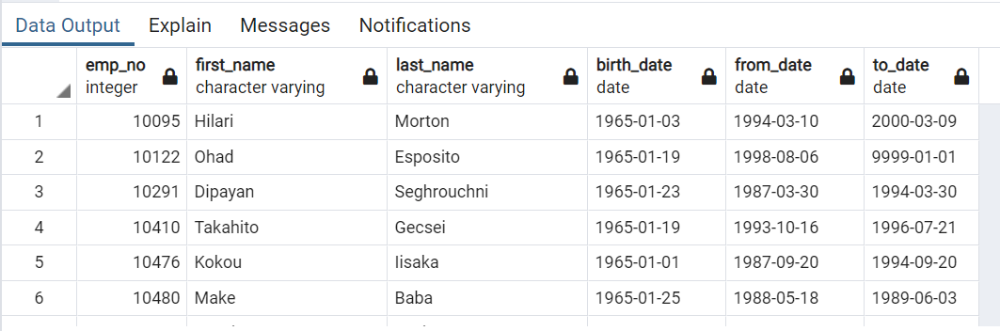
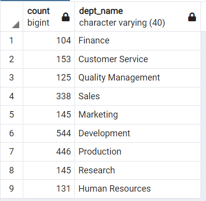

# Pewlett-Hackard-Analysis
## Pewlett-Hackard Employee- Retirement-Analysis
This challenge uses postgres sql.Here Pewlett hackard has planned to provide  a retirement package  for their employees who met certain criteria. There are also some positions that has to be filled as a result of silver tsunami.For this we Determine the number of retiring employees per title, 
and identify employees who are eligible to participate in a mentorship program.

## The Number of Retiring Employees by Title

1. Below is a snippet of the **retirement_titles table.** 
It shows employees who were born between 1952 january 1st and 1955 december 31st 
with their details including,**Employee number, Name, Title,** and their **company Joining
date** to **current date.**

2. This is a sample part of the **Unique_titles Table** image below shows us the latest/recent title of each
Employee along with their **Employee number, Full name and Title name** 

3.This below image  displays  the total number of **Employees** for each **Recent job
 title** who are about to retire.
 
 

4. Another table here gives information  about Mentorship Eligibility 
of the employees who are eligible to participate in a mentorship program who is born
between between January 1, 1965 and December 31, 1965 with their latest titles.

## SUMMARY
1.Based on **Mentorship Eligibility Data, 1940 Roles** need to be filled as the **"silver tsunami"** begins to make an impact.

2.There are enough qualified, **retirement-ready employees** in the departments to mentor the next generation of Pewlett Hackard employees as show in the below table,
Which show number of employees in the count column available for mentoring newbies in each department.
The query for this table is below it.

**SELECT count(me.emp_no),
d.dept_name
FROM mentorship_eligibilty as me
LEFT JOIN dept_emp as de
ON me.emp_no = de.emp_no
LEFT JOIN departments as d
ON de.dept_no = d.dept_no
GROUP BY d.dept_name**
